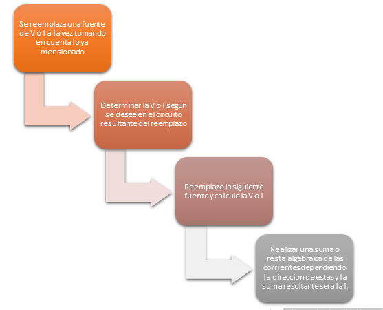

# PRACTICA-No.-3-TEOREMA-DE-SUPERPOSICION

# INFORME

1. OBJETIVOS 

1.1. OBJETIVO GENERAL

- Determinar la usabilidad del teorema de superposicoin aplicado a un circuito con 2 fuentes de voltaje  y modelado en un simulador virtual.

 1.2. OBJETIVO ESPECIFICO  
   

- Identificar la polaridad del voltaje y la direccion del la corriete en el circuito propuesto.
- Identificar en el simulador con ayuda de un multimetro la corriente que pasa por la resistencia cuando se hace cortocircuito cada una de las fuentes de voltaje.

- Analisar los resultados tanto analiticos como experimentales  obtenidos en el simulador virtual y  verificar si existe un error porcentual.

2. MARCO TEORICO

3. DIAGRAMAS

Lo que haremos es pasar del diagrama electrico a al protoboard 

4. LISTA DE COMPONENTES

| CANTIDAD|MATERIAL O EQUIPO|
| ----- | ---- |
| 2|Fuente de Voltaje de C.D.|
|2|Multimetros digitales|
|1|Resistor de 1 kΩ|
|2|Resistores de 2.2 kΩ|
|1|Resistor de 820 kΩ|
|1|Resistor de 470 kΩ|
|1|Protoboard|

Tambien se utilizo tinkercad que nos sirvio como laboratorio virtual.

5. EXPLICACION 

1)  Abrimos el simulador de Tinkercad y seleccionamos nuevo circuito
2) Elegimos los materiales a usar en la practica que constan de un Protoboard, una resistencia de 1k ohm, 2,2k ohm, 820 ohm y 470 ohm, 2 fuentes de voltaje de 20 y 12 V
3)  Armamos el circuito que se nos da en la figura 4.1
4)  Para aplicar el teorema de superposicion comenzamos retirando la fuente de 20V
5) Con ayuda de un multimetro medimos el VA y la corriente Ix
6) Anotamos los resultados obtenidos en la tabla 4.1
7) Ahora devolvemos la fuente retirada anteriormente y retiramos la fuente de 12V
8) Repetimos el paso 5 
9) Anotamos los resultados en la tabla 4.2

Tabla 4.1. Medición de voltaje aplicando superposición.

Tabla 4.2. Medición de corriente aplicando superposición.

5.2 Verifique el cumplimiento del Teorema de Superposición y compare los
resultados obtenidos prácticamente con los obtenidos analíticamente. Realice sus
conclusiones.

Como se puede observar en las anotaciones se llega a cumplir el teorema de superposicion al realizar la suma algebraica o en este caso la resta de las corrientes y voltajes obtenidos de cada fuente por separado, asi podemos analizar que dicho teorma nos permite analizar a los circuitos con 2 o mas fuentes de una manera mas sencilla.

Con lo referente a los calculos del erro porcentual, sigue siendo minimo puesto que estamos en un laboratorio virtual, el error presente es mas por las aproximaciones de los decimales y de no ser asi hasta no se podria allar ni un error en la simulacion y la practica.

6. CONCLUCION 

- El teorema de superposicion nos facilita  el analisis de circuitos que contengas 2 o mas fuentes  ya sea de V o I ya que nos permite desconectar las demas fuentes y analizar en presencia de una sola.

- Analitica y experimentalmente se observa un error que es minimo debido a que se ocupa un simulador virtual y no se lo arma fisicamente pero estos errores podiran ser aun mas exactos ya que depende de los decimales que se ocupe en el analisis analitico.

7. BIBLIOGRAFIA

Ayllón Fandiño, E. (1987). Fundamentos de la teoría de los circuitos eléctricos II

Sadiku. (s.f.). Teoremas de circuitos. En Sadiku, Fundamentos de Circuitos Eléctricos

Floyd, T. (2007). PRINCIPIOS DE CIRCUITOS ELÉCTRICOS. (8va ed.). Mexico, Mexico: Pearson Education.

